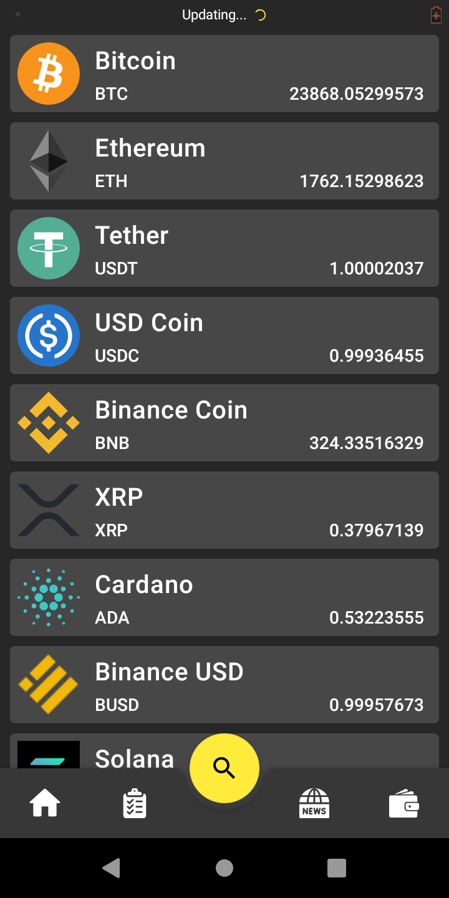
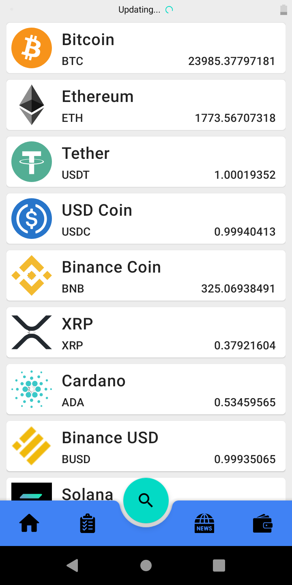
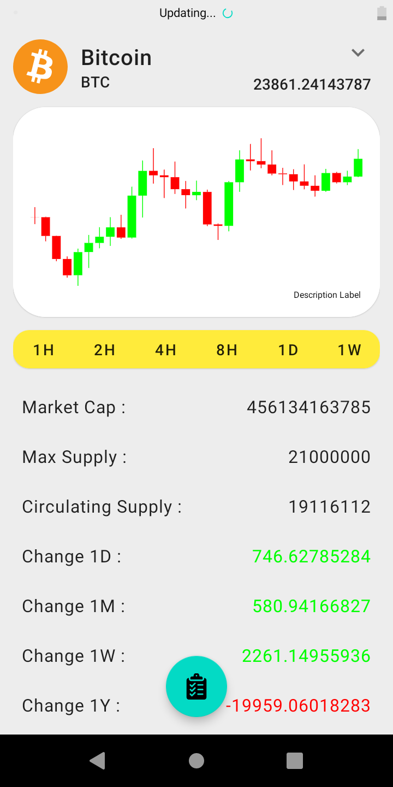

# CryptoOverview
An application that shows you an overview of the cryptocurrency market.

| | |
|:---:|:---:|
|||
|||

# Introduction
List of all Crypto Currncies with chart.  
I tried to use new approaches and best practices in android development, such as :

* Jetpack libraies
* Kotlin
* Coroutines
* MVVM pattern
* Dependency Injection

**It is a practice project to improve my knowledge.**

# Technologies

* Kotlin 1.4
* Room Database 2.2
* Retrofit 2.9
* Hilt 2.3 beta (Dependency injection based on Dagger)
* Navigation 2.3
* Lifecycle 2.3
* Glide 4 (Remote image loader)
