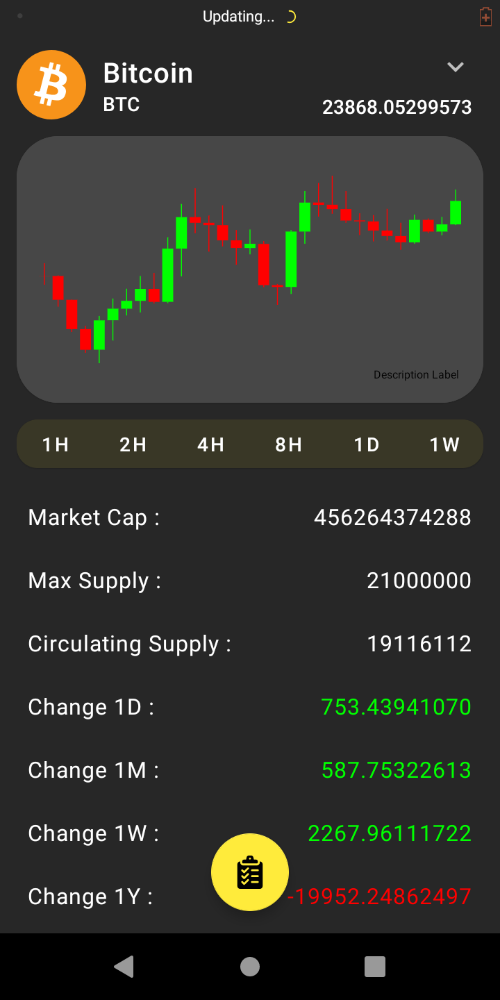

# CryptoOverview
Crypto Currency Market Over View

# Table of contents
* [General info](#general-info)
* [Technologies](#technologies)
* [Screenshots](#screenshots)

# General info
List of all Crypto Currncies with chart.  
I tried to use new approaches and best practices in android development, such as :

* Using jetpack libraies
* Using MVVM pattern
* Using Kotlin insted of Java
* Dependency Injection

It is a practice project to improve my knowledge.

# Technologies

* Kotlin 
* Room Database
* Retrofit
* Hilt

# Screenshots

| | |
|:---:|:---:|
|||
|||
